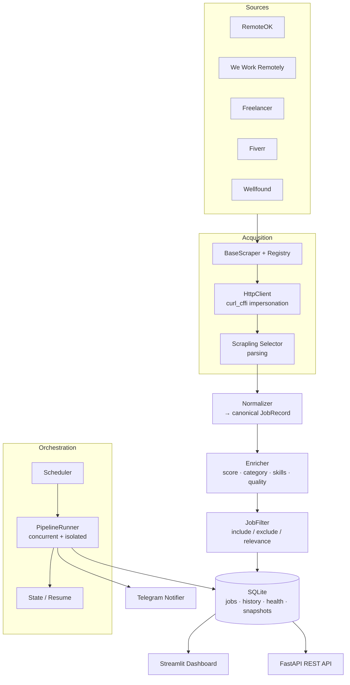
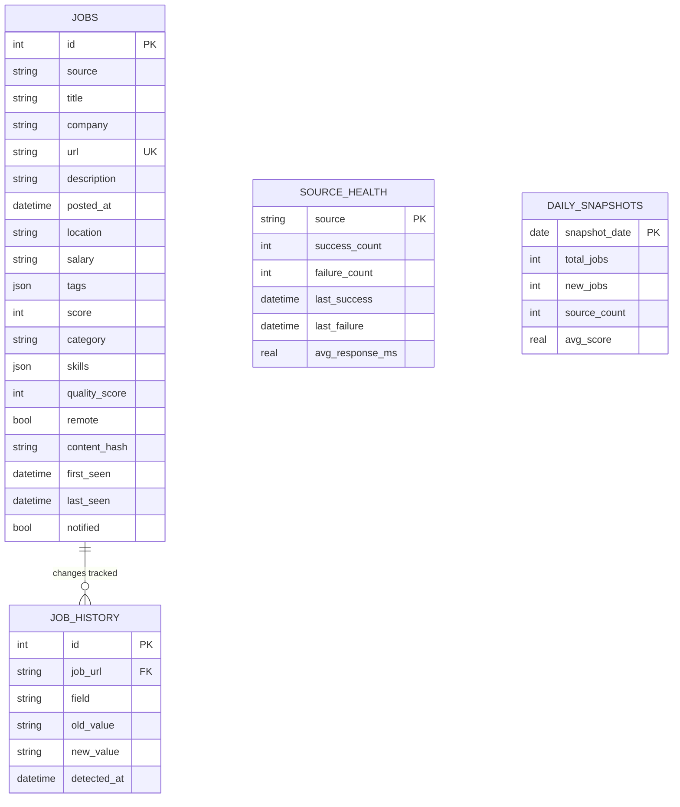

<div align="center">

# 🛰️ Multi-Source AI Job Intelligence Monitor

**A production-grade platform that scrapes, normalizes, scores, stores, and visualizes
remote & freelance job opportunities from five sources — with Telegram alerts, a Streamlit
analytics dashboard, and a REST API.**

[](.github/workflows/test.yml)
[](.github/workflows/lint.yml)


*Scraping • Automation • Data Engineering • Monitoring • Analytics • Software Architecture*

</div>

---

## 📌 Overview

The Job Intelligence Monitor continuously collects job postings from **RemoteOK, We Work
Remotely, Freelancer, Fiverr, and Wellfound**, normalizes them into a single schema, enriches
each one with a **relevance score, category, skills, and a data-quality score**, deduplicates
and tracks changes over time, then surfaces everything through **Telegram alerts**, a
**Streamlit + Plotly dashboard**, and a **FastAPI REST API**.

It is built on top of the vendored **[Scrapling](README_SCRAPLING.md)** engine (reused for
adaptive HTML/JSON parsing and browser-impersonation fetching) and wraps it in a clean, layered,
fully-tested application.

> ⚠️ **Security note:** secrets (Telegram bot token) are read only from a gitignored `.env`.
> See [Configuration](#-configuration). Never commit real tokens.

---

## ✨ Features

| | Feature | Detail |
|---|---|---|
| 🌐 | **5 source scrapers** | RemoteOK (JSON API), We Work Remotely (RSS), Freelancer (JSON API), Fiverr & Wellfound (public embedded JSON, best-effort) |
| 🧩 | **Normalization layer** | One canonical `JobRecord`; no source-specific shape leaks downstream |
| 🧠 | **Intelligence** | Relevance scoring, auto-categorization, skill extraction, data-quality scoring |
| 🗃️ | **SQLite + repository pattern** | Dedup on URL, change detection with history, source health, daily snapshots |
| 🔔 | **Telegram alerts** | New-job alerts, daily summary, startup & error notifications |
| 📊 | **Streamlit dashboard** | Overview, analytics (Plotly), job explorer w/ filters, source health, config UI |
| ⏱️ | **Scheduler** | Concurrent scraping, configurable interval, graceful shutdown, resume state |
| 🛡️ | **Resilience** | Per-source failure isolation, health tracking, retries, backup & archive |
| 📤 | **Exports** | CSV / Excel / JSON |
| 🧪 | **Quality** | 63 tests, CI (lint + tests), type hints, docstrings, Docker, demo mode |
| 🔮 | **Extensible** | AI-enrichment interface, knowledge-graph layer, MCP registry, REST API |

---

## 🖼️ Screenshots

> Generate live screenshots with the dashboard running (`streamlit run
> job_monitor/dashboard/app.py`). Placeholders are described in [`screenshots/`](screenshots/).

| Dashboard Overview | Analytics |
|---|---|
|  |  |

| Job Explorer & Export | Source Health |
|---|---|
|  |  |

| Telegram Alert |
|---|
|  |

---

## 🏗️ Architecture



**Layered design** (dependencies point downward): Interfaces → Orchestration → Services →
Domain → Acquisition. Full rationale in [IMPLEMENTATION_PLAN.md](IMPLEMENTATION_PLAN.md).

### Database schema



---

## 🚀 Quickstart

### Local (Python 3.11+)

```bash
# 1. Install dependencies (into a virtualenv)
python -m venv .venv && source .venv/bin/activate
pip install -r requirements-dashboard.txt        # core + app + dashboard

# 2. Configure (optional — leave Telegram blank to disable alerts)
cp .env.example .env

# 3. See it instantly with demo data
python generate_demo_data.py
streamlit run job_monitor/dashboard/app.py        # → http://localhost:8501

# 4. Run a real scrape
python main.py --once       # one cycle
python main.py --status     # show state + source health
python main.py --loop       # run continuously on POLLING_INTERVAL
```

### Docker (one command)

```bash
cp .env.example .env
docker compose up --build
# scheduler runs the pipeline; dashboard on http://localhost:8501
```

### REST API (optional)

```bash
pip install -r requirements-api.txt
uvicorn job_monitor.api.app:app --reload          # docs at http://localhost:8000/docs
```

### ☁️ Deploy to Streamlit Community Cloud (+ automated scraping & Telegram)

Host the dashboard for free and run scheduled scraping + Telegram alerts via GitHub Actions —
see **[docs/DEPLOYMENT.md](docs/DEPLOYMENT.md)**. The repo is pre-configured: Cloud-ready
`requirements.txt`, a dashboard that auto-loads data (with a **🌐 Scrape live now** button), and
a scheduled scrape workflow that refreshes data and pushes alerts.

---

## ⚙️ Configuration

All settings come from environment variables / `.env` (see [`.env.example`](.env.example)).
Secrets are **never** hardcoded.

| Variable | Default | Purpose |
|---|---|---|
| `TELEGRAM_BOT_TOKEN` / `TELEGRAM_CHAT_ID` | — | Telegram credentials (blank ⇒ alerts disabled) |
| `NOTIFY_ENABLED` / `NOTIFY_MIN_SCORE` | `true` / `10` | Toggle + score threshold for alerts |
| `POLLING_INTERVAL` | `3600` | Seconds between scrape cycles |
| `ENABLE_REMOTEOK` … `ENABLE_WELLFOUND` | `true` | Per-source toggles |
| `MAX_WORKERS` | `5` | Concurrent scrapers |
| `INCLUDE_KEYWORDS` / `EXCLUDE_KEYWORDS` | — | Filtering overrides (defaults in `config/keywords.py`) |

The **Configuration** page in the dashboard edits these (safe keys only) without touching code.

---

## 🧠 How the intelligence works

Each normalized job is enriched (deterministically, no API keys needed):

- **Relevance score** — sum of weighted keyword matches (`python` +10, `automation` +10, …).
- **Category** — best match among Automation, Web Scraping, E-commerce, AI, Data Engineering,
  Python Development, API Integration, Dashboard Development.
- **Skills** — canonical extraction (Python, Django, FastAPI, Selenium, Docker, AWS, Shopify, …).
- **Quality score** — field-completeness (0–100).

An [AI-enrichment interface](job_monitor/ai/enrichment.py) ships with a working rule-based
implementation and a typed seam for plugging in an LLM later.

---

## 📁 Project structure

```
job_monitor/
  config/        settings (pydantic) · keyword taxonomy · source labels
  models/        JobRecord · SourceHealth · DailySnapshot · JobChange
  scrapers/      base · 5 sources · registry · http (curl_cffi adapter)
  normalizers/   raw → canonical JobRecord
  pipeline/      enrichment · filters · concurrent runner
  database/      connection · schema.sql · repositories
  notifications/ Notifier interface · Telegram · formatters
  analytics/     metrics · exporters (CSV/Excel/JSON)
  dashboard/     Streamlit app · views · components
  services/      state/resume · backup · archive · demo data
  ai/ graph/ mcp/ api/   extension layers (real interfaces)
  observability/ structured rotating logging
main.py · generate_demo_data.py · Dockerfile.app · docker-compose.yml
```

See [docs/ARCHITECTURE.md](docs/ARCHITECTURE.md) for the folder-by-folder breakdown.

---

## 🧪 Testing

```bash
pip install -r requirements-dev.txt
pytest -c pytest_job_monitor.ini                  # 63 tests, no network/browser needed
```

Scrapers are tested against saved fixtures; the runner uses fake scrapers + a capturing
notifier; the dashboard is smoke-tested headlessly via Streamlit `AppTest`.

---

## 🗺️ Roadmap

See [ROADMAP.md](ROADMAP.md) and [PORTFOLIO_RECOMMENDATIONS.md](PORTFOLIO_RECOMMENDATIONS.md).
Highlights: LLM-powered daily digest, Slack/email notifiers, hosted demo, Postgres + migrations,
saved searches & per-user alert profiles.

---

## 💼 Portfolio value

This repository is designed to demonstrate, end-to-end: **web scraping & anti-bot handling,
browser-automation readiness, data engineering & database design, monitoring & observability,
Telegram automation, analytics dashboards, software architecture, and deployment readiness
(Docker + CI).** See [PORTFOLIO_RECOMMENDATIONS.md](PORTFOLIO_RECOMMENDATIONS.md).

---

## 🙏 Credits & license

Built on the vendored **[Scrapling](README_SCRAPLING.md)** scraping engine by Karim Shoair
(BSD-3). Application code © its authors, released under the same BSD-3 license — see
[LICENSE](LICENSE).

> **Ethical scraping:** this project targets public endpoints, uses conservative rate limits,
> and is intended for personal job monitoring and portfolio demonstration. Respect each site's
> Terms of Service and `robots.txt`.
